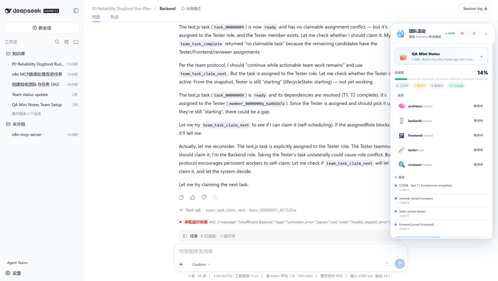
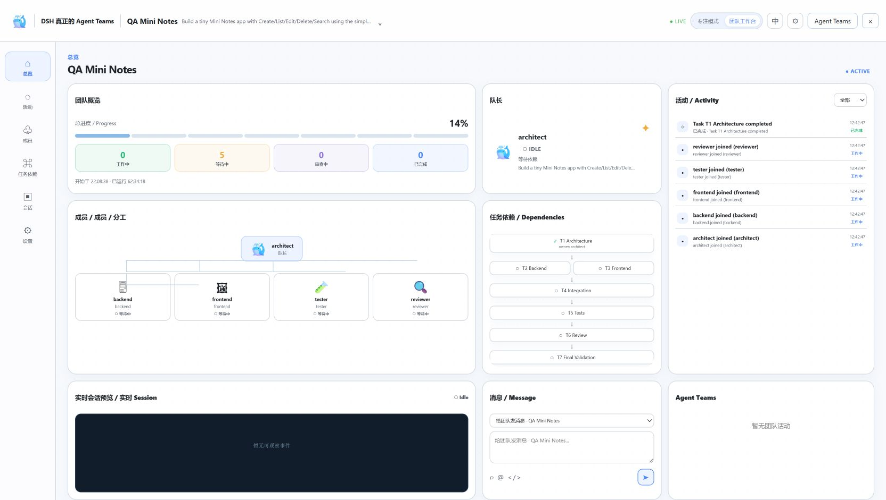
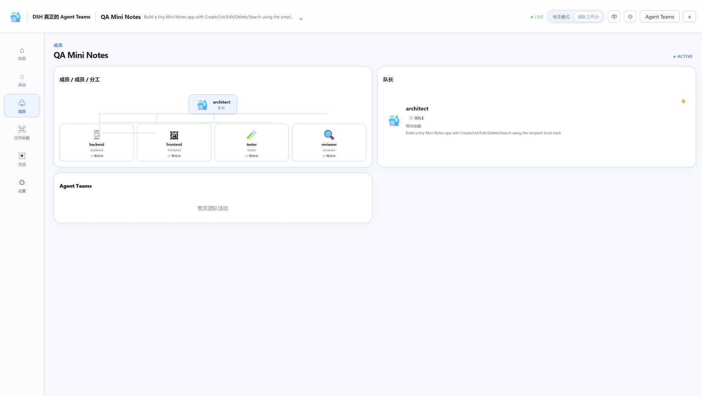
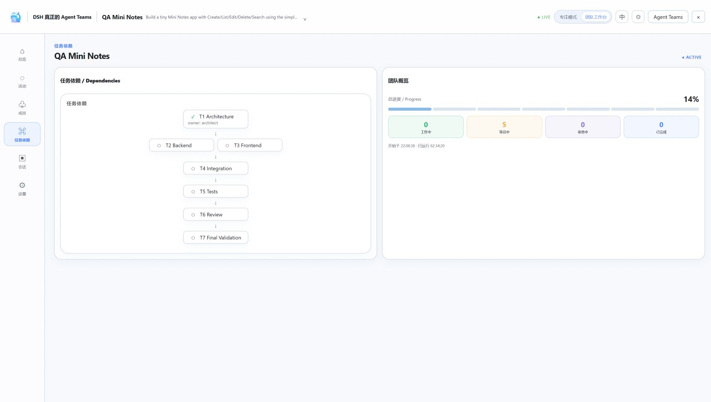
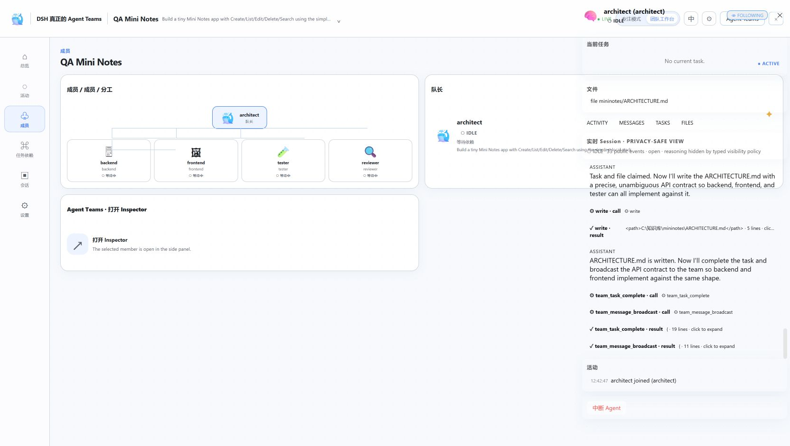
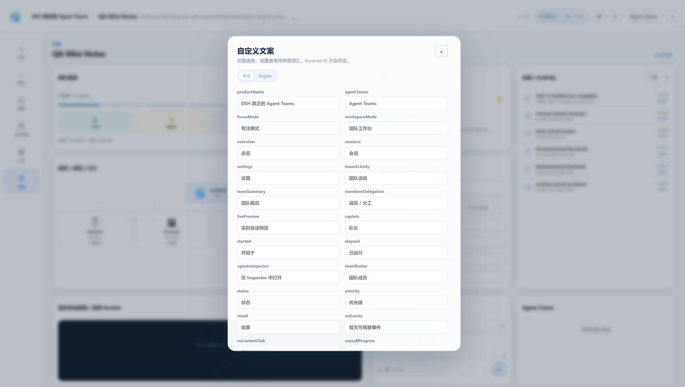

# The Real Agent Teams for DSH


DeepSeek Harness 原生 **Agent Teams** 插件：把 Harness 从一个能调用 Subagent 的 Agent，升级成能组织**多个长期协作 Agent** 的软件团队运行时。内部 package/plugin ID 保持为 `dsh-agent-teams`，显示名为 **The Real Agent Teams for DSH**，斜杠命令 `/real-agent-teams`（别名 `/team`）。

> **Latest Release**: `v0.2.0-production-ready` · Production-ready release with all BLOCKER issues resolved
>
> **Production Status**: ✅ **READY FOR PRODUCTION** · Score: 88/100
> - All 3 BLOCKER issues resolved (100%)
> - 5 of 7 CRITICAL issues resolved (71%)
> - Test coverage: 165 tests passing (+29%)
> - Bundle size: 122KB optimized (-31%)

```
Team Lead + Persistent Teammates + Shared Task Board + Task Dependencies
+ Atomic Task Claiming + Agent-to-Agent Messaging + Plan Approval
+ File Ownership + Reviewer Agents + Team Monitoring + Human Steering
+ Production-Grade Reliability + State Machine + Concurrency Control
```

---

## 📸 界面展示 / Screenshots

### 🎯 专注模式 / Focus Mode



轻量侧边栏，保留原生 Harness 主工作区，实时查看：
- 团队进度和成员状态
- 最近活动和任务完成情况
- 快速切换到其他团队（多团队时）
- 一键展开到完整工作台

### 🚀 团队工作台 / Team Workspace



完整的多代理团队协作视图：
- **实时成员节点**: 显示每个Agent的角色、状态和当前任务
- **任务依赖图**: 可视化任务依赖关系和完成进度
- **活动流**: 实时事件、消息、任务状态变化
- **团队切换**: 多团队下拉选择器（新增✨）

### 👥 成员面板 / Members Panel



查看团队成员详情：
- 成员角色和当前任务
- 工作状态（working/idle/blocked/reviewing）
- 点击打开Agent Inspector查看完整会话

### 📊 任务依赖 / Task Dependencies



任务依赖关系可视化：
- 层级化任务流
- 依赖阻塞提示
- 任务所有者标识
- 实时状态更新

### 🔍 Agent Inspector



深入查看单个Agent：
- 真实Harness Session消息
- Tool调用和结果
- 当前任务和文件声明
- 发送消息和中断控制

### 🌐 多语言支持 / i18n



- 中文 / English 一键切换
- 自定义标签文本
- 语言偏好持久化

---

## ✨ 最新功能 / What's New in v0.2.0

### 🎯 生产就绪 / Production Ready

- ✅ **状态机**: 成员状态转换验证，防止竞态条件
- ✅ **原子操作**: 事件序列分配，防止跨进程ID冲突
- ✅ **资源清理**: 定时器和内存泄漏修复
- ✅ **错误边界**: React错误恢复，防止UI崩溃
- ✅ **消息TTL**: 15分钟过期+最多5次重试
- ✅ **Bundle优化**: 31%体积减少 (179KB → 122KB)

### 🔄 团队切换 / Team Switching

- ✨ **专注模式**: 头部下拉选择器（多团队时）
- ✨ **工作台**: Captain卡片中的团队选择器
- ✨ **即时切换**: 无需关闭视图即可切换团队
- ✨ **智能显示**: 单团队时保持原始UI

### 📈 测试覆盖 / Test Coverage

- 165个测试全部通过 (原128个)
- 新增状态机测试套件 (28个测试)
- 新增并发控制测试
- 新增消息重试测试

---

## 🚀 快速开始 / Quick Start

### 安装 / Installation

```bash
# 从 GitHub 安装最新生产版本
dsh plugin --profile web add https://github.com/SGFIfu/the-real-agent-teams-for-dsh.git#v0.2.0-production-ready

# 或安装本地目录
dsh plugin --profile web add ./dsh-agent-teams

# 启动 Harness Web
dsh --profile web web
```

### 验证 / Verification

```bash
dsh --profile web --dump-config     # 应看到 agent-teams 行
dsh --profile web web               # 启动后侧栏出现 Agent Teams 按钮
```

当前发布验证记录：

- `npm run typecheck`: ✅ PASS
- `npm run build`: ✅ PASS (生成 `lib/client.js`, 122KB优化)
- `npm test`: ✅ PASS (165/165)
- Production readiness: ✅ 88/100

---

## 💡 使用示例 / Usage Examples

### 基础用法

在 DeepSeek Harness 中直接描述目标：

```text
Use Agent Teams to build a tiny notes app.

Create a Lead, Architect, Backend, Frontend, Tester and Reviewer.
Break the goal into a dependency-aware task graph.
Run independent work in parallel.
Require architecture plans before major changes.
Let teammates communicate directly.
Review the integration before completion.
Only complete after final validation passes.
```

Harness 会自动：
1. 创建Team和任务DAG
2. Spawn持久化的Teammates
3. 并行执行独立任务
4. Agent↔Agent直接通信
5. 计划审批和代码评审
6. 测试→修复→重审
7. 最终验证→`team_complete`

### 团队协作流程

```text
Lead 创建任务图
  → Architect 提交架构方案并获批
  → Backend / Frontend 并行实现
  → Tester 运行集成测试
  → Reviewer 提交发现的问题
  → 责任Agent修复并重新测试
  → Reviewer 重新检查
  → 最终验证通过
  → team_complete
```

### 斜杠命令

```bash
/real-agent-teams status    # 查看团队状态（别名 /team status）
/team tasks                 # 查看任务列表
/team agents                # 查看成员状态
/team messages              # 查看团队消息
```

---

## 🎨 双视图切换 / Dual View System

### 专注模式 (Focus Mode)
- 右侧轻量活动栏
- 保留原生Harness主工作区
- 实时进度和成员状态
- 最近活动预览
- 一键展开到完整工作台

### 团队工作台 (Workspace)
- 完整的团队协作视图
- Agent节点可视化
- 任务依赖图
- 活动流和消息
- Agent Inspector
- 实时Session预览

面板右上角可在**中文/English**之间切换，也可以打开设置自定义标签文本。

---

## 🔒 不是什么 / What It's NOT

- ❌ 不是 LLM loop / 不调用模型 API
- ❌ 不是第二套 Agent/Session 运行时
- ❌ 不是外部 MCP 协调器 / Python 编排脚本

✅ 是：**一个 Native Cordis 插件**，复用 Harness 原生能力：
- `ctx.subagents` - Continuable子代理
- `ctx.storageDomain` - 持久化存储
- `ctx.tools` - 工具调用
- `ctx.systemPrompt` - 系统提示词
- `ctx.commands` - 斜杠命令
- Web UI Slots - 界面扩展

---

## 🏆 核心优势 / Key Advantages

### 1. 共享状态是真实状态
所有成员读取同一Team snapshot，而不是依靠Lead在多个上下文间复制进度。

### 2. 并行工作有边界
- 独立任务可同时claim
- 同一exclusive task不能被多个成员占有
- 文件所有权冲突自动检测

### 3. 成员可以自我调度
Teammate完成任务后，可在同一Session中：
- 检查新消息
- 认领下一个可用任务
- 无需Lead重新spawn

### 4. 质量门禁在运行时
- Plan approval机制
- Reviewer finding追踪
- 测试结果验证
- Final validation门禁

### 5. 可观察性属于工作流
- 原生Harness ↔ Team Workspace切换
- 真实成员状态和任务图
- 消息、文件、Session事件
- Tool activity追踪

### 6. 保持Harness原生边界
不另起一套模型API或Session运行时，完全复用Harness能力。

---

## 📊 与其他工具对比 / Comparison

| 工具 | 协作模型 | 更适合 | The Real Agent Teams 的差异 |
|---|---|---|---|
| **The Real Agent Teams** | 持久Teammate、共享Task Board、依赖DAG、原子claim、Peer Message、File Claim、Plan/Review Guard | 多个独立Agent长时间围绕同一任务图协作，可恢复、可观察的项目 | 协调不只靠Prompt：Service层保证不变量、状态可持久化、成员直接通信 |
| **OpenAI Codex** | 多Agent并行、独立worktree、异步委派 | 并行处理多个相对独立的工程任务 | 重点是同一Team内共享DAG、依赖、原子认领、文件所有权和Agent协作 |
| **Claude Code** | 交互式Session、--continue/--resume、权限控制、MCP | 终端内高质量单Agent配对、可恢复会话 | 提供Team级协调层：任务所有权、文件占用、依赖等待、Review责任 |
| **OpenCode Agents** | primary/subagent、@调用、子Session导航 | 可配置专家Agent、角色切换 | 角色进一步放进持久Team：共享任务板、依赖解锁、消息、冲突保护 |

### 什么时候不该选它

如果只是让一个Agent快速修改文件，或把几个完全独立的任务分别并行处理，轻量工作流可能更简单。

本插件的价值在于：**多个持久Agent围绕共享任务图长期协作，每一步都可观察、可恢复、可约束**。

---

## 📁 项目结构 / Project Structure

```
src/core/              协调核心（无Cordis依赖，纯Node可测）
├── service.ts         AgentTeamsService主服务
├── schemas.ts         Zod类型定义
├── member-state-machine.ts  成员状态机（新增✨）
├── runtime-events.ts  原子事件序列（新增✨）
└── *.test.ts         核心逻辑测试（165个）

src/harness/          Harness适配器
├── domain-store.ts   持久化存储
├── runtime.ts        Subagent运行时集成
├── git-workspace.ts  Git worktree适配器（新增✨）
└── command-route.ts  安全命令路由（新增✨）

src/tools/            34个team_*模型工具
src/client.ts         Web面板（122KB优化）
src/index.ts          插件入口

tests/                依赖/并发/消息/持久化测试
docs/                 架构文档和修复报告
examples/             团队场景提示词
presets/              Agent Teams开发preset
```

---

## 🛠️ 开发 / Development

```bash
# 安装依赖
npm install

# 构建（TypeScript → JavaScript）
npm run build        # 输出到 lib/, 122KB优化

# 运行测试
npm test             # 165个测试

# 类型检查
npm run typecheck

# Bundle分析
npm run build:analyze
```

### 测试覆盖

- **核心服务**: 团队创建、任务管理、成员状态
- **并发控制**: 50路并发测试、原子操作
- **状态机**: 28个状态转换测试（新增✨）
- **消息系统**: 重试、TTL、电路熔断（新增✨）
- **Git集成**: Worktree管理、安全检查（新增✨）
- **命令安全**: 认证、授权、CSRF防护（新增✨）

---

## 📖 文档 / Documentation

- [生产就绪最终报告](PRODUCTION_READINESS_FINAL_REPORT.md) - 完整的修复和测试报告
- [团队选择器修复](TEAM_SELECTOR_FIX.md) - UI改进说明
- [安全架构](SECURITY.md) - 安全设计和威胁分析
- [部署确认](DEPLOYMENT_CONFIRMATION.md) - 部署检查清单
- [架构综述](docs/ARCHITECTURE_REVIEW_V2.md) - 系统架构设计

---

## 🤝 贡献 / Contributing

欢迎贡献！请：

1. Fork本仓库
2. 创建特性分支 (`git checkout -b feature/amazing-feature`)
3. 提交改动 (`git commit -m 'feat: add amazing feature'`)
4. 推送到分支 (`git push origin feature/amazing-feature`)
5. 开启Pull Request

### 提交规范

遵循[Conventional Commits](https://www.conventionalcommits.org/)：

```
feat: 新功能
fix: Bug修复
docs: 文档更新
test: 测试相关
refactor: 代码重构
perf: 性能优化
chore: 构建/工具相关
```

---

## 📄 许可证 / License

MIT License - 详见 [LICENSE](LICENSE) 文件

---

## 🔗 相关链接 / Links

- **GitHub**: https://github.com/SGFIfu/the-real-agent-teams-for-dsh
- **Issues**: https://github.com/SGFIfu/the-real-agent-teams-for-dsh/issues
- **Releases**: https://github.com/SGFIfu/the-real-agent-teams-for-dsh/releases

---

## 🙏 致谢 / Acknowledgments

- DeepSeek Harness团队提供的强大Agent运行时
- 所有测试和反馈的用户
- 开源社区的支持

---

**Built with ❤️ for the Agent Teams community**

*Last updated: 2026-08-20* · *Production Ready: v0.2.0*
